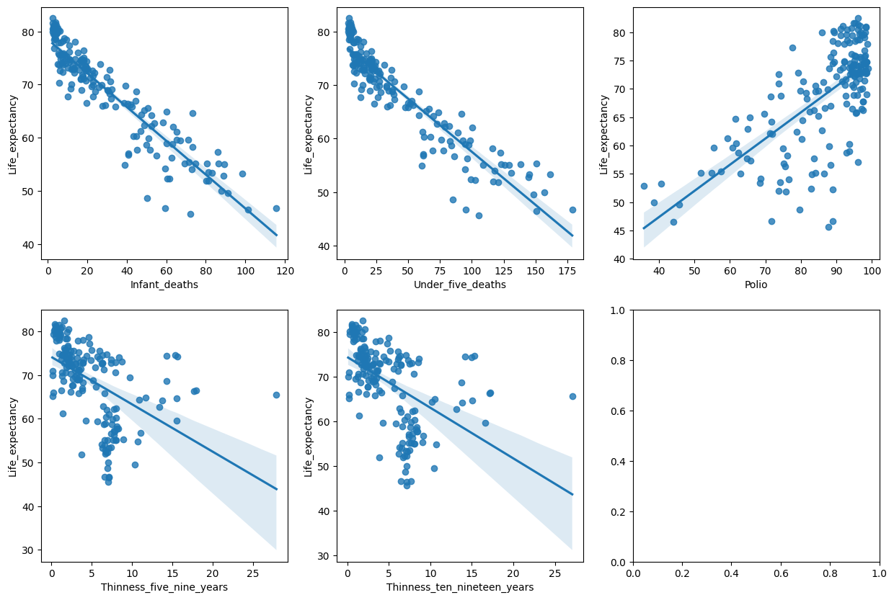
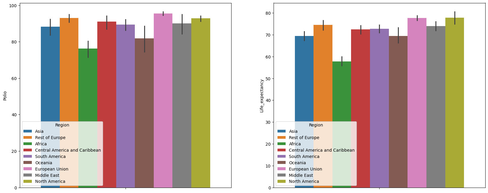

# **프로젝트 명 : 기대수명에 영향을 미치는 요인 분석** 🚀  

 

---

## 🌟**팀명**
 

## 생명의 방정식 🍀
 

## 🌟 **팀원 소개**  

| 이름      | GitHub ID                          |
|-----------|------------------------------------|
| 🧑‍💻 박유진  | [@YUJINDL01](https://github.com/YUJINDL01) |
| 👩‍💻 이다인  | [@daainn](https://github.com/daainn)        |
| 👩‍💻 이재혁  | [@ohdyo](https://github.com/ohdyo)          |
| 👨‍💻 최재동  | [@Monkakaka](https://github.com/Monkakaka) |

 

---

## 🛠️ **기술 스택**  

| **분류**         | **기술/도구**                                                                            |
|------------------|------------------------------------------------------------------------------------------|
| **언어**         |      |
| **라이브러리**   |             |
| **협업 툴**      |              |

 

---

## 📄 **프로젝트 설명**  

### 0. 프로젝트 주제 선정 배경

  

[Click here for more information](https://www.yna.co.kr/view/AKR20240806040000017)

 

#### 프로젝트 목적
우리 팀은 이 연구에서 한발 더 나아가, 국가적 요인(건강, 교육, GDP, 경제) 및 다양한 변수들이 기대수명에 어떤 영향을 미치는지 구체적으로 분석하여 인사이트를 도출하고자 합니다.

 

### 1. 데이터 선택 근거  

* 해당 데이터셋은 다양한 국가의 평균 수명 데이터를 통합한 것으로, 사회경제적 요인과 건강 관련 지표도 함께 제공한다. 
* 따라서 해당 데이터셋을 통해 수명과 지표 간의 상관관계 및 지역 간 불평등을 분석하는 데 유용할 것이라 판단하여서 데이터를 선택하였다.

**데이터 출처**

 

---

### 2. 데이터 구조  

#### **분석 타겟 컬럼**
- `Life_expectancy` (float): 기대수명

   

#### **유아, 청소년 관련 변수**  
- `Infant_deaths` (float): 영아 사망 수  
- `Under_five_deaths` (float): 5세 이하 사망 수  
- `Polio` (float): 소아마비 예방접종률  
- `Thinness_five_nine_years` (float): 5-9세 저체중 비율  
- `Thinness_ten_nineteen_years` (float): 10-19세 저체중 비율  

#### **건강 관련 변수**  
- `Diphtheria` (float): 디프테리아 예방접종률  
- `Incidents_HIV` (float): HIV 발생 건수  
- `Hepatitis_B` (float): B형 간염 예방접종률  
- `Measles` (float): 홍역 사례 수  

#### **경제적 사회적 요인 변수**  
- `Country` (object): 국가명  
- `Region` (object): 지역명  
- `GDP_per_capita` (float): 1인당 GDP  
- `Population_mln` (float): 인구 (백만 명 단위)  

#### **생활 수준 및 습관 관련 변수**  
- `BMI` (float): 평균 BMI(체질량지수)  
- `Schooling` (float): 평균 교육 연수  
- `Economy_status` (object): 경제 상태 (예: 저소득, 중소득, 고소득)  
- `Alcohol_consumption` (float): 1인당 알코올 소비량  
- `Adult_mortality` (float): 성인 사망률

   

### 3. 데이터 기초 통계량  
|   | Year   | Infant_deaths | Under_five_deaths | Adult_mortality | Alcohol_consumption | Hepatitis_B | Measles | BMI     | Polio   | Diphtheria | Incidents_HIV | GDP_per_capita | Population_mln | Thinness_ten_nineteen_years | Thinness_five_nine_years | Schooling | Economy_status | Life_expectancy |
|---|--------|---------------|-------------------|-----------------|---------------------|-------------|---------|---------|---------|------------|---------------|----------------|-----------------|-----------------------------|--------------------------|-----------|----------------|-----------------|
| **count**      | 179.0  | 179.000000     | 179.000000        | 179.000000      | 179.000000          | 179.000000  | 179.000000 | 179.000000 | 179.000000 | 179.000000  | 179.000000     | 179.000000      | 179.000000     | 179.000000             | 179.000000              | 179.000000 | 179.000000     | 179.000000      |
| **mean**       | 2007.5 | 30.363792      | 42.938268         | 192.251775      | 4.820882            | 84.292598   | 77.344972 | 25.032926 | 86.499651 | 86.271648   | 0.894288       | 11540.924930   | 36.675915      | 4.865852               | 4.899825               | 7.632123  | 0.793296       | 68.856075       |
| **std**        | 0.0    | 26.725485      | 42.916952         | 111.659044      | 3.914554            | 13.820223   | 17.315208 | 2.165490  | 13.581153 | 13.931532   | 2.311895       | 16893.054182   | 136.655286     | 4.111094               | 4.195663               | 3.126912  | 0.406077       | 9.197699        |
| **min**        | 2007.5 | 2.381250       | 3.000000          | 57.710313       | 0.000025            | 30.687500   | 16.250000 | 20.212500 | 35.750000 | 31.312500   | 0.010000       | 263.937500     | 0.085000       | 0.100000               | 0.100000               | 1.337500  | 0.000000       | 45.606250       |
| **25%**        | 2007.5 | 8.159375       | 9.775000          | 107.046906      | 1.317813            | 78.218750   | 64.000000 | 23.225000 | 80.531250 | 80.812500   | 0.080000       | 1409.906250    | 2.108125       | 1.756250               | 1.731250               | 4.946875  | 1.000000       | 62.303125       |
| **50%**        | 2007.5 | 19.368750      | 23.137500         | 164.432406      | 4.209375            | 88.000000   | 83.000000 | 25.650000 | 92.375000 | 92.062500   | 0.164375       | 4402.625000    | 7.660625       | 3.556250               | 3.718750               | 7.831250  | 1.000000       | 71.506250       |
| **75%**        | 2007.5 | 48.959375      | 68.321875         | 247.523922      | 7.843438            | 94.375000   | 92.250000 | 26.425000 | 96.062500 | 95.781250   | 0.516250       | 12037.781250   | 22.745313      | 7.165625               | 7.056250               | 10.365625 | 1.000000       | 74.937500       |
| **max**        | 2007.5 | 115.718750     | 178.725000        | 572.974312      | 15.100000           | 98.875000   | 99.000000 | 31.687500 | 98.937500 | 99.000000   | 18.164375      | 102972.687500  | 1321.239375    | 27.100000              | 27.943750              | 13.268750 | 1.000000       | 82.456250       |

> *year 변수는 년도가 2007.5로 고정되어있기 때문에 eda컬럼에서 제외*

 

---

### 4. 데이터 전처리  

 

### **데이터 결측값**
* 데이터 결측값은 `df.isnull().sum()`을 통해 확인해 본 결과 존재하지 않아서, 따로 처리를 하지 않았다.

 
  
### **데이터 이상값**

#### **수치형 변수 이상값 확인**

  

* 수치형 변수의 이상치를 확인하기 위해 Boxplot으로 시각화 해본 결과 `Alcohol_consumption`, `Schooling`, `Life_expectancy`을 제외하고 사분위수를 기준으로 이상치가 존재하였다.
* 각 변수별 이상치는 변수의 특성을 분석하여 따로 처리하는 것이 좋을 것이라 판단하여 컬럼 별로 분석하여 이상치를 처리하였다.

 

#### **범주형 변수 이상값 확인**

  <table>
    <tr>
      <!-- 첫 번째 표 -->
      <td>
        <table>
          <thead>
            <tr>
              <th>Country</th>
              <th>Count</th>
            </tr>
          </thead>
          <tbody>
            <tr>
              <td>Afghanistan</td>
              <td>1</td>
            </tr>
            <tr>
              <td>Albania</td>
              <td>1</td>
            </tr>
            <tr>
              <td>Algeria</td>
              <td>1</td>
            </tr>
            <tr>
              <td>Angola</td>
              <td>1</td>
            </tr>
            <tr>
              <td>...</td>
              <td>...</td>
            </tr>
          </tbody>
        </table>
      </td>
      <!-- 두 번째 표 -->
      <td>
        <table>
          <thead>
            <tr>
              <th>Region</th>
              <th>Count</th>
            </tr>
          </thead>
          <tbody>
            <tr>
              <td>Africa</td>
              <td>51</td>
            </tr>
            <tr>
              <td>Asia</td>
              <td>27</td>
            </tr>
            <tr>
              <td>European Union</td>
              <td>27</td>
            </tr>
            <tr>
              <td>Central America and Caribbean</td>
              <td>19</td>
            </tr>
            <tr>
              <td>...</td>
              <td>...</td>
            </tr>
          </tbody>
        </table>
      </td>
    </tr>
  </table>

*  `value_counts`를 통해 범주형 변수의 이상치를 확인해 본 결과 모든 나라가 1개의 열로 들어가 있는 것을 확인하였다.
*  또한 대륙(지역)별로도 나라가 알맞게 들어가 있는 것을 확인하였다.

 

### **컬럼별 이상치 분석**

#### **GDP와 인구수 이상치 분석**

  

* 산점도를 확인해 본 결과 지역(대륙)별로 GDP와 인구수가 다른 경향을 보이는 것으로 파악돼 각각 지역별로 나누어 평균과 표준편차를 통해 Z-SCORE를 게산한 후 Z-SCORE값이 3이 넘는 수치를 확인해보았다.

 
  

  

  

 

  

    <table border="1">
      <thead>
        <tr>
          <th>Region</th>
          <th>Country</th>
          <th>GDP_per_capita_Z</th>
        </tr>
      </thead>
      <tbody>
        <tr>
          <td>Africa</td>
          <td>Equatorial Guinea</td>
          <td>3.308435</td>
        </tr>
        <tr>
          <td>Africa</td>
          <td>Libya</td>
          <td>3.011919</td>
        </tr>
        <tr>
          <td>Central America and Caribbean</td>
          <td>Bahamas, The</td>
          <td>3.263916</td>
        </tr>
        <tr>
          <td>Africa</td>
          <td>Seychelles</td>
          <td>3.368514</td>
        </tr>
        <tr>
          <td>European Union</td>
          <td>Luxembourg</td>
          <td>3.617869</td>
        </tr>
        <tr>
          <td>Asia</td>
          <td>Singapore</td>
          <td>3.341175</td>
        </tr>
      </tbody>
    </table>
  

  

    <table border="1">
      <thead>
        <tr>
          <th>Region</th>
          <th>Country</th>
          <th>Population_mln_Z</th>
        </tr>
      </thead>
      <tbody>
        <tr>
          <td>Africa</td>
          <td>Nigeria</td>
          <td>4.920200</td>
        </tr>
        <tr>
          <td>Asia</td>
          <td>India</td>
          <td>3.204249</td>
        </tr>
        <tr>
          <td>Rest of Europe</td>
          <td>Russian Federation</td>
          <td>3.201684</td>
        </tr>
        <tr>
          <td>South America</td>
          <td>Brazil</td>
          <td>3.046067</td>
        </tr>
        <tr>
          <td>Asia</td>
          <td>China</td>
          <td>3.608051</td>
        </tr>
        <tr>
          <td>European Union</td>
          <td>Germany</td>
          <td>3.029649</td>
        </tr>
      </tbody>
    </table>
  

* 분포상 Z-score가 3을 넘는 값들이 위와 같이 존재하였다.
* 경제적 특성과 국가 크기 차이에 따라 판단했을 때 이상치로 판단되는 값들이 그 지역의 특성상 자연스러운 값이라고 판단되어  이상치로 판단하지 않고 EDA를 진행하였다.
* 예) 인구 수의 경우 인도와 중국이 지역 평균에 비해 월등이 뛰는 것이 타당함.

 

---

 

### 5. 데이터 EDA (탐색적 데이터 분석)  

#### **5-1. 유아, 청소년 관련 변수와 기대수명간의 관계 EDA**  

**1. 요소 간의 상관관계 파악**

  

* `영아 사망 수`와 `5세 이하 사망 수` 이 두가지와  `5-9세 저체중 비율`과 `10-19세 저체중 비율` 이 두가지는 각각 밀접한 상관관계를 보였으나 이것은 이것들이 거의 같은 요소를 담고 있기 때문으로 보임.
* `기대수명`과 가장 큰 상관관계를 보인 요소는 `영아 사망 수`와  `5세 이하 사망 수`다. 영유아 사망률이 높을수록 기대수명이 낮아진다는 것을 보여준다.
* 그 다음으로 높은 상관관계를 보인 것은  `소아마비 예방 접종율`로 접종율이 높을수록 기대수명도 높다.
* 저체중 관련 요소 둘은 비교적 낮은 상관관계를 보였다.
* 기대수명을 제외한 요소들 중 가장 큰 상관관계를 보인것은 `영아 사망 수`, `5세 이하 사망 수` 둘 과 `소아마비 예방 접종율`이다.

  

* 산점도와 추세선을 그려보았을때 좀 더 시각적으로 확인할 수 있는데 기대수명과 저체중 요소들은 신뢰구간이 넓게 나타나 상관관계가 약함을 알수 있다.

  

* 지역별 기대수명과 소아마비 예방 접종율을 나타낸 그래프로, 두 그래프가 비슷한 형태를 띄고 있어 접종율과 기대수명간의 관계를 알 수 있다.
 
 

#### **5-2. 건강 관련 변수와 기대수명간의 관계 EDA**  
 

**1. 국가별 기대수명 분포**
 

  

 

* 목적: 전체 국가의 기대수명 분포를 확인하고, 상위 및 하위 그룹 평균의 차이를 시각적으로 비교하여 '기대수명' 차이를 이해.
* 설명: 기대수명의 전체 분포를 히스토그램으로 시각화하고, 세계 평균, 상위 10개 국가, 하위 10개 국가의 평균을 선으로 표시.
 

**2. 상위/하위 기대수명 그룹의 건강 요소 비교**
 

  

 

* 목적: '건강 요인(예방접종률, 질병 사례)'의 차이가 기대수명에 미치는 영향을 상위/하위 그룹 간 차이로 분석.
* 설명: 상위 10개 국가와 하위 10개 국가의 디프테리아, B형 간염 예방접종률, 홍역 사례 수를 박스플롯으로 비교.
 

**3. 건강 요소와 기대수명 간의 관계**
 

  

 

* 목적: 각 건강 요인과 기대수명 간의 '상관관계'를 정량적으로 파악하고, 요인별 영향을 평가.
* 설명: 디프테리아, B형 간염 예방접종률과 홍역 사례 수와 기대수명 간의 관계를 산점도와 회귀선을 통해 시각화.
 

**4. 전체 및 그룹별 상관 관계 히트맵**
 

  

 

* 목적: 전체 및 그룹별로 건강 요인이 기대수명에 미치는 '상관성 강도'를 비교하여 상위/하위 그룹 간 차이를 확인.
* 설명: 전체 국가, 상위 10개 국가, 하위 10개 국가의 건강 요인과 기대수명 간의 상관 관계를 히트맵으로 표시.
 

#### **5-3. 경제적 사회적 요인간의 관계 EDA**

**1. 국가별 기대수명**

  

* 나라 별로 기대수명을 시각화 해본 결과 대륙(지역)별로 비슷한 기대수명을 공유하는 경향이 보여 대륙별로 추가 분석을 진행해보았다.

     

**2. 대륙(지역)별 기대수명**

> 지역별 분포를 가시적으로 확인해보기 위해 커널 밀도 추정으로 확인해보았다.

  

* `아프리카(Africa)` 지역은 가장 낮은 기대수명을 보이며, 국가 간 편차가 큰 편이다.
* `오세아니아(Oceania)`, `유럽(Rest of Europe)`, `북아메리카(North America)`는 높은 기대수명을 공유하며, 분포가 좁고 국가 간 편차가 작다.
* `중남미 및 아시아 지역`은 중간 수준의 기대수명을 보이지만, 일부 국가는 더 높은 기대수명을 가지며 분포가 넓게 퍼져 있다.

   

**3. GDP, 인구수별 기대수명**

> GDP의 경우 로구 곡선 형태를 띄고 있기도 하고 또 그래프를 해석할 때 선형관계를 더 직관적으로 파악하여 해석하기 위해 로그 변환을 사용한 후 산점도를 그렸다.

  

* GDP에 따른 기대수명 변화
    * GDP가 낮은 구간에서는 기대수명이 상대적으로 낮고 변동폭도 크다.
    * GDP가 증가할수록 기대수명이 뚜렷하게 상승하며, 변동폭이 감소한다.특히 20K 이상 구간에서는 기대수명이 75세 이상으로 안정화되며, GDP가 더 증가해도 큰 변화는 없다.
    * 회귀선을 기준으로 데이터가 고르게 분포하여 상관관계가 뚜렷함을 알 수 있다.

* 인구수에 따른 기대수명 변화
    * 인구가 적은 나라는 기대수의 분포가 넓고 국가 간 편차가 크다. 반대로 인구가 많은 나라는 기대수명이 상대적으로 좁은 범위에 걸쳐져 있다.
    * 로그 변환된 인구와 기대수명 간에 회귀선의 기울기가 수평에 가까워 뚜렷한 상관관계는 발견되지 않았다.
 
   

#### **5-4. 생활 수준 및 습관 관련 변수**
- corr 보기 전 데이터 분석 방법 : BMI수치에 따른 성인 사망자 순 집계가 사람의 체형에 따라 다를거라 생각해서 분석
  - 객과적인 데이터보다 내가 생각하기에 체형의 균형이 무너지면 성인병에 걸릴 확률이 높아져 둘의 연관 관계가 있을거라고 생각하고 분석
  - BMI를 WHO가 제시해주는 기준으로 카테고리를 분류
  - 이후 정규화를 진행하여 둘의 관계 분석
  - 대륙별로 BMI의 기준이 사망자 수에 영향을 미치는지 분석
- corr관계 결과 이후 분석 방법 : 자강 상관관계가 뚜렷한 교육기간 과 성인 사망자 수의 관계를 분석
  - corr에서 상관관계가 뚜렷한 교육연수 기간 과 성인 사망자 수(음의 관계)에 관해 분석 진행
  - 교육 연수 기간과 성인 사망자 수 데이터를 정규화를 진행하여 분석
  - 대륙별로 차이가 존재하는지 분석

 

  

##### ***1. BMI 와 성인 사망자 수 관계 분석***

  
  

##### ***2. 기대수명과 성인 사망자 수의 관계 분석***

  
  

 

### 6. 최종 인사이트  

#### 지역적 요인과 기대수명 

* 대륙(지역)별로 기대수명이 뚜렷한 차이를 보인다.
* 특히, 아프리카 지역은 낮은 기대수명과 높은 국가 간 편차를 보이지만, 오세아니아, 유럽, 북아메리카는 높은 기대수명과 국가 간 격차가 상대적으로 작은 것으로 보아 안정된 경제적 환경이 기대수명에 큰 영향을 준다는 것을 알 수 있다.
  
#### 경제적 요인(GDP)과 기대수명

* GDP는 기대수명에 강한 양의 상관관계를 보이며, 0-10K에서는 GDP차이에 따라 기대수명의 차이가 크게 나지만 GDP 20K 이상에서는 기대수명이 약 75세 이상으로 안정화되는 경향을 확인할 수 있었다.
* 이는 경제적 성장이 일정 수준 이상 도달했을 때, 기대수명을 결정짓는 주요 요인이 경제 외적 요소로 이동할 수 있음을 나타내며, 또한 저소득 국가에서는 조금의 경제 성장이 기대수명을 크게 증가시키는 핵심 전략이 될 수 있음을 파악할 수 있다.
  
#### 인구수와 기대수명

* 인구수와 기대수명은 뚜렷한 상관관계가 발견되지 않았으나, 인구가 적은 국가에서 기대수명의 분산이 큰 경향이 있었다.
* 이는 작은 국가일수록 특정 지역적, 경제적 요인이 국가 전체의 기대수명에 상대적으로 큰 영향을 미칠 수 있음을 시사한다

#### BMI와 기대수명
- BMI와 기대수명은 성인병 유발과 관계가 있다 생각하여 긴밀한 관계를 가질것 같았지만, 분석 결과 전혀 연관성이 없었다.
- 혹시 대륙별로 구분지으면 관련이 있을까 했지만 전혀 관련이 없었다. 이를 통해 사전지식을 바탕으로 생각한 가설이 틀린걸 확인할수 있었다.

#### 기대수명과 성인 사망자 수의 관계
- 성인 사망자수와 기대수명이 반비레 관계인것을 corr 상관관계를 통해서 확인할수 있었다.
- 이 수치가 맞는지 확인하기 위해 대륙별로 나눠서 산포도를 찍어봤고  사망자 수는 증가할수록 기대 수명이 당연히 줄어드는는 음의 관계를 보이는것을 확인했다.

#### 건강요인과 기대수명
- 디프테리아 예방접종률: 전체 국가에서 강한 양의 상관관계를 보이며, 예방접종률이 높을수록 기대수명이 증가한다. 상위 10개 국가에서는 영향이 미미하고, 하위 10개 국가에서는 낮은 예방접종률이 기대수명 감소와 연관이 있다.
- B형 간염 예방접종률: 전체적으로 중간 정도의 양의 상관관계를 보이며, 예방접종률이 높을수록 기대수명이 증가하는 경향이 있다. 상위 국가에서는 약한 상관관계를 보이고, 하위 국가에서는 낮은 예방접종률이 기대수명 감소와 연결된다.
- 홍역 사례 수: 전체적으로 중간 정도의 양의 상관관계를 보이며, 홍역 사례가 많을수록 기대수명이 낮아진다. 상위 국가에서는 상관이 없지만, 하위 국가에서는 강한 음의 상관관계를 보인다.

 

---

 

## 🌈 **팀원 한 줄 회고**  

| 이름      | 한 줄 회고                                                          |
|-----------|--------------------------------------------------------------------|
| 박유진     | 전 세계, 상위, 하위 10개의 평균을 구할 때 수치가 정확하게 위치하게 하는 것에 어려움을 겪었습니다. 높이는 히스토그램 그래프의 가장 높은 축의 y축의 위치로, 평균선의 x축의 값은 글자들의 x축 값이 되게 처리 하였지만, 제가 정말 원했던 것은  글자 속에 있는 : 가 평균선 위에 오는 것이 였습니다. 그것을 하기 위해서는 find나 index를 이용해 : 위치를 알아내어 글자의 크기+간격 만큼 글자 수를 곱해 위치를 보정하는 것으로 해결해보겠습니다.  |
| 이재혁     | eda 도출전 사전지식을 바탕으로 예상 결과를 가지고 예상했으나 전처리 과정을 거치고 정규화를 진행하면서 내 예상과는 다른 객관적인 수치가 보여지는것을 확인했고 데이터 전처리와 정규화 가정을 통해서 내 가정이 맞는지 아니라면 왜 아닌지 분석할수 있었더 좋은 미니 프로젝트였다.  |
| 이다인     | 지도를 통해 시각화하는 과정에서 geopandas 라이브러리를 사용하여, 지리적 객체를 저장하기 위한 shp 파일을 파이썬에서 읽어올 수 있다는 점을 알게 되었고, 지도와 데이터를 병합하는 과정에서 데이터의 국가명 표기 차이를 해결하기 위해 병합 전에 국가명을 소문자로 변경하거나 띄어쓰기를 없애는 등의 전처리가 필수라는 것을 깨달았다. |
| 최재동     | 요소들의 상관관계 분석을 하며 추세선의 신뢰구간같은 개념들에 대해 다시 복습하는 계기가 되었고, 팀원들의 작업물을 보며 geopandas나 folium 같은 새로운 라이브러리에 대해 새롭게 접하고 공부하게된 좋은 경험이었다. |
